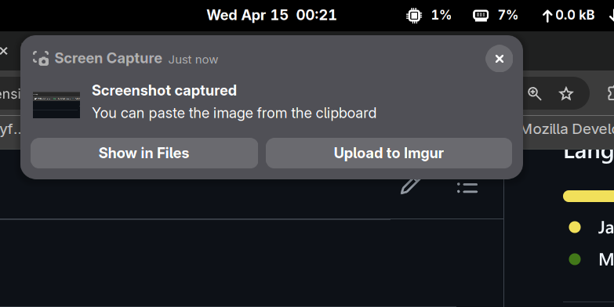

# Imgur Screenshot Uploader

GNOME Shell extension for GNOME 50 that watches new screenshot files, offers an `Upload to Imgur` action, and then shows the uploaded link with a `Copy Link` action.

## Notes

- You must configure your own Imgur `Client ID` in the extension preferences.
- The extension monitors `~/Pictures` and `~/Pictures/Screenshots`.
- Uploads are done with `curl`, so `curl` must be available on the system.
- run command 'gnome-extensions prefs imgur-screenshot-uploader49@local' to config client id of your imgur

## Install

1. Copy this directory to `~/.local/share/gnome-shell/extensions/imgur-screenshot-uploader49@local`.
2. Make sure `schemas/gschemas.compiled` is present in that directory.
3. Enable the extension with `gnome-extensions enable imgur-screenshot-uploader49@local`.
4. Open extension preferences and fill in your Imgur `Client ID`.

## Screenshot

